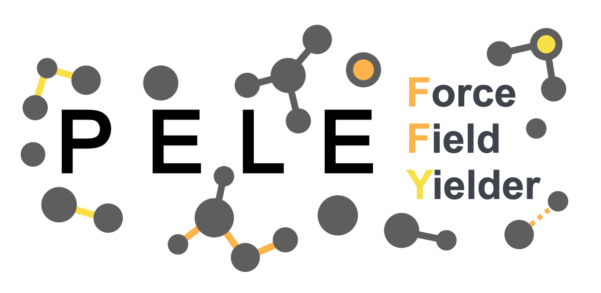

| **About** | [](LICENSE) [](https://martimunicoy.github.io/peleffy) [](https://github.com/martimunicoy/peleffy/releases/) |
| :------ | :------- |
| **Status** | [](https://lgtm.com/projects/g/martimunicoy/peleffy/context:python) [](https://github.com/martimunicoy/peleffy/actions?query=workflow%3ATest) [](https://codecov.io/gh/martimunicoy/peleffy) |
| **Installation** | [](https://anaconda.org/martimunicoy/peleffy) [](https://pypi.org/project/peleffy/) |

# PELE Force Field Yielder

<p align="left">
  
</p>

The `peleffy` (PELE Force Field Yielder) is a Python package that builds [PELE](https://pele.bsc.es/pele.wt)-compatible force field templates. The current supported force fields are:
- Any force field from the [Open Force Field toolkit](https://github.com/openforcefield/openforcefield).
- OPLS2005.
- A combination of them.

## Documentation
The documentation for the `peleffy` package is available at [GitHub Pages](https://martimunicoy.github.io/peleffy).

## Main features

### Small molecules parameterization
It can take a molecular structure from a PDB file or a SMILES tag and parameterize it with any of the supported force fields. The resulting parameters are stored in a dictionary-like object that can be easily manipulated.

```python
from peleffy.topology import Molecule
from peleffy.forcefield import OpenForceField

molecule = Molecule('path_to_pdb_file.pdb')
openff = OpenForceField('openff_unconstrained-1.3.0.offxml')

parameters = openff.parameterize(molecule)
```

### Template generation
A peleffy's molecular representation can be employed, along with its parameters, to build a Topology file. A Topology file is a wrapper of topological elements that can be written as an Impact template file, compatible with PELE.

```python
from peleffy.topology import Topology
from peleffy.template import Impact

topology = Topology(molecule, parameters)

impact_template = Impact(topology)
impact_template.to_file('ligand_parameters.txt')
```

A template with the OBC parameters for the implicit solvent of PELE can also be generated.
```python
from peleffy.solvent import OBC2

obc2_solvent = OBC2(topology)
obc2_solvent.to_file('ligand_obc.txt')
```

It can also generate the rotamer library file for the side chain exploration of PELE.
```python
from peleffy.topology import RotamerLibrary

rotamer_library = RotamerLibrary(molecule)
rotamer_library.to_file('ligand_rotamers.txt')
```

### User-friendly CLI
All the commands above can be run with a single CLI directive.
```bash
python -m peleffy.main path_to_pdb_file.pdb -f 'openff_unconstrained-1.3.0.offxml' --with_solvent
```

## Contributors
For a full list of contributors, see the [GitHub Contributors page](https://github.com/martimunicoy/peleffy/graphs/contributors).
