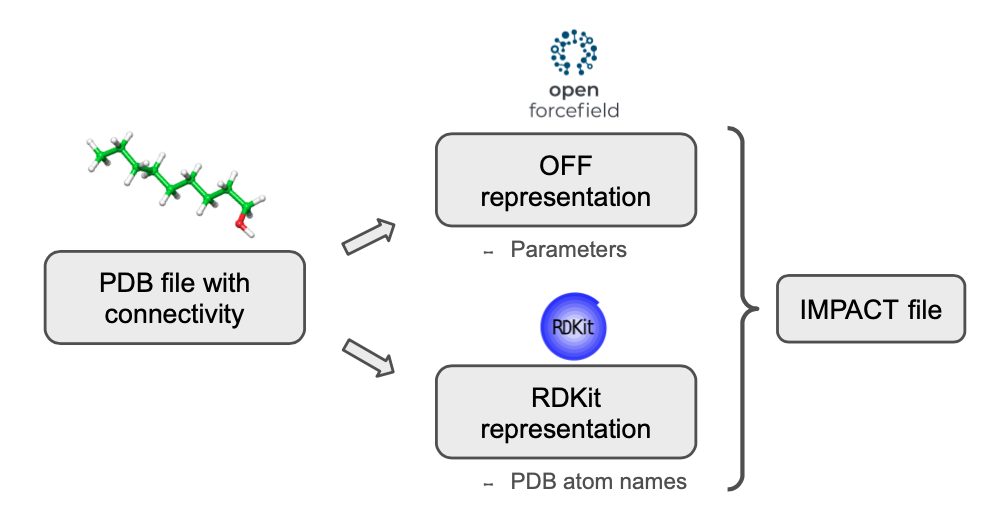

.. _installation ::

Generate PELE parameter files
*****************************

The main purpose of `peleffy` is to build the parameter files for PELE. Basically, PELE requires two files for each non-standard residue found in the system:

- `IMPACT template <https://nostrumbiodiscovery.github.io/pele_docs/fileFormats.html#sec-fileformats-impact>`_: a file containing the atom types and parameters of the ligand. Its job is to link each atom with the corresponding parameters using PDB atom names. Thus, PDB atom names in the input PDB file must match with the expected PDB atom names in the Impact file. This file intrinsically contains the information about the topology and connectivity of each residue.

- `Rotamer library <https://nostrumbiodiscovery.github.io/pele_docs/fileFormats.html#sec-fileformats-ligandrotamers>`_: a file containing the branches that can rotate with respect to a central atomic core. Each branch consists in a set of consecutive rotatable bonds.

Besides, a third file with the `Solvent parameters` might be required when employing the OBC implicit solvent.

.. image:: figures/PELE_templates_scheme.png
  :width: 400
  :alt: Scheme with all the files that PELE requires to run a simulation

The `Open Force Field Toolkit <https://github.com/openforcefield/openforcefield>`_ is employed to assign the parameters to each atom according to its chemical environment. Besides, the PDB atom names are stored using `RDKit <https://www.rdkit.org>`_. With this dual molecular representation, `peleffy` can run the parameterization workflow of Open Force Field while tracking the PDB atom names with RDKit.

Basic usage
===========
The more straightforward way to install `peleffy` along with the required dependencies is through the command-line interface built in `main.py <https://github.com/martimunicoy/peleffy/blob/master/peleffy/main.py>`_ module. Therefore, the parameter files for a particular ligand can be obtained with:

.. code-block:: bash

   $ python -m peleffy.main my_ligand.pdb

.. code-block::

     ------------------------------------------------------------
     Open Force Field parameterizer for PELE 1.1.0
     ------------------------------------------------------------
      - General:
        - Input PDB: my_ligand
        - Output path: None
        - Write solvent parameters: False
        - DataLocal-like output: False
      - Parameterization:
        - Force field: openff_unconstrained-1.3.0.offxml
        - Charge method: am1bcc
      - Rotamer library:
        - Resolution: 30
        - Exclude terminal rotamers: True
     ------------------------------------------------------------
      - Initializing molecule from PDB
        - Loading molecule from RDKit
        - Assigning stereochemistry from 3D coordinates
        - Setting molecule name to 'ligand'
        - Setting molecule tag to 'LIG'
        - Representing molecule with the Open Force Field Toolkit
      - Generating rotamer library
        - Core set to the center of the molecule
      - Loading 'openff_unconstrained-1.3.0.offxml'
      - Parameterizing molecule
      - Parameters were built successfully:
        - 12 atoms
        - 12 bonds
        - 18 torsions
        - 24 propers
        - 6 impropers
      - Generating solvent parameters
      - All files were generated successfully:
        - /Users/martimunicoy/repos/BSC/peleffy/LIG.rot.assign
        - /Users/martimunicoy/repos/BSC/peleffy/ligz
        - /Users/martimunicoy/repos/BSC/peleffy/ligandParams.txt
     ------------------------------------------------------------

Command-line arguments
======================
Almost all the important settings can be tuned up through command-line
arguments. To obtain the full list of flags you can type:

.. code-block:: bash

   $ python -m peleffy.main --help

.. code-block::

     usage: main.py [-h] [-f NAME] [-r INT] [-o PATH] [--with_solvent]
                    [--as_datalocal] [-c NAME] [--include_terminal_rotamers]
                    PDB FILE

     positional arguments:
       PDB FILE              Path PDB file to parameterize

     optional arguments:
       -h, --help            show this help message and exit
       -f NAME, --forcefield NAME
                             OpenForceField\'s forcefield name. Default is
                             openff_unconstrained-1.2.0.offxml
       -r INT, --resolution INT
                             Rotamer library resolution in degrees. Default is 30
       -o PATH, --output PATH
                             Output path. Default is the current working directory
       --with_solvent        Generate solvent parameters for OBC
       --as_datalocal        Output will be saved following PELE's DataLocal
                             hierarchy
       -c NAME, --charge_method NAME
                             The name of the method to use to compute charges
       --charges_from_file PATH
                             The path to the file with charges
       --include_terminal_rotamers
                             Not exclude terminal rotamers when building the
                             rotamer library

Find below the complete list of command-line arguments in full detail.

PDB file
--------
It is a mandatory positional argument that points to the PDB file which
contains ligand to parameterize.

- Flag: ``PDB FILE``
- Type: ``string``
- Example: the code below will run `peleffy` to parameterize the ligand at `path/to/my_ligand.pdb`

  .. code-block:: bash

        $ python -m peleffy.main path/to/my_ligand.pdb

Force field
-----------
It defines the force field to employ to parameterize the ligand. It can
be any supported force field shipped by the OpenFF toolkit or the
Schrodinger's OPLS2005.

  .. warning::
      Working with Schrodinger's OPLS2005 requires a valid Schrodinger
      installation with the ffld_server. An environment variable called
      `SCHRODINGER` must be set, pointing to the Schrodinger's
      installation path.

- Flag: ``-f NAME``, ``--forcefield NAME``
- Type: ``string``
- Default: ``openff_unconstrained-1.2.0.offxml``
- Example: the code below will run peleffy using the forcefield named as 'openff_unconstrained-1.0.0.offxml'

  .. code-block:: bash

        $ python -m peleffy.main path/to/my_ligand.pdb -f openff_unconstrained-1.0.0.offxml

Rotamer library resolution
--------------------------
It defines the resolution, in degrees, to use in the rotamer library.

- Flag: ``-r INT``, ``--resolution INT``
- Type: ``int``
- Default: ``30``
- Example: the code below will run peleffy using a resolution of 60 for the rotamer library

  .. code-block:: bash

        $ python -m peleffy.main path/to/my_ligand.pdb -r 60

Output path
-----------
It defines the output path where the resulting files will be saved.

- Flag: ``-o PATH``, ``--output PATH``
- Type: ``string``
- Default: ``.``, the current working directory
- Example: the code below will save the results into my_custom_folder/

  .. code-block:: bash

        $ python -m peleffy.main path/to/my_ligand.pdb -o my_custom_folder

Include solvent parameters
--------------------------
It also generates the OBC solvent parameters and saves them into the output location.

- Flag: ``--with_solvent``
- Default: ``False``, do not include
- Example: the code below will generate and save the OBC solvent parameters

  .. code-block:: bash

        $ python -m peleffy.main path/to/my_ligand.pdb --with_solvent

Save output as DataLocal
------------------------
It saves the output files following the DataLocal hierarchy expected by PELE.

- Flag: ``--as_datalocal``
- Default: ``False``, do not save output files as DataLocal
- Example: the code below will generate and save output files following the DataLocal hierarcy of PELE

  .. code-block:: bash

        $ python -m peleffy.main path/to/my_ligand.pdb --as_datalocal

Charge method
-------------
It sets the method to compute the partial charges.

- Flag: ``-c NAME``, ``--charge_method NAME``
- Type: ``string``
- Choices: one of [``gasteiger``, ``am1bcc``, ``OPLS``]
- Default: ``am1bcc``
- Example: the code below will calculate partial charges using 'gasteiger' method

  .. code-block:: bash

        $ python -m peleffy.main path/to/my_ligand.pdb -c gasteiger

Charge from file
----------------
It sets the method to load external partial charges.

- Flag: ``--charges_from_file PATH``
- Type: ``string``
- Default: ``None``
- Example: the code below will load the partial charges from a MAE file

  .. code-block:: bash

        $ python -m peleffy.main path/to/my_ligand.pdb --charges_from_file path/to/my_ligand.mae

Include terminal rotamers
-------------------------
It always includes terminal rotamers, even if they belong to a terminal methyl group whose rotation is trivial in PELE.

- Flag: ``--include_terminal_rotamers``
- Default: ``False``, exclude terminal rotamers
- Example: the code below will generate a rotamer library including all terminal rotamers

  .. code-block:: bash

        $ python -m peleffy.main path/to/my_ligand.pdb --include_terminal_rotamers
